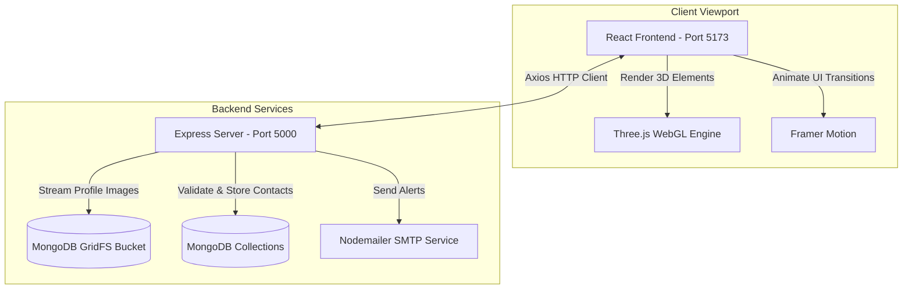

# 3D/HUD Cyber Portfolio

A futuristic, highly polished 3D HUD developer portfolio built to display interactive telemetry, project cards, skill hierarchies, and communication pathways.

To deploy the website :
https://portfolio-9n8i.onrender.com/

---

## 🔍 Overview

This portfolio serves as a visual and functional technical command center, moving away from static resume sites. It addresses two primary challenges:
1.  **High Memory Overhead in WebGL:** Interactive 3D interfaces are notorious for memory leaks and tab crashes. This project implements complete garbage collection loops for WebGL geometries and materials.
2.  **API Resilience:** If database connections are offline, the contact form drops back gracefully to local browser cache / partial transmission alerts, keeping the interface operational.

---

## 🎨 Key Features

*   **🤖 3D Robot Assistant (Three.js):** Segmented torso plates, mechanical joints, rotating reactor core ring, base projection grid, and particle systems. Features automatic WebGL context garbage collection.
*   **📁 MongoDB GridFS Profile Image Module:** Streams binary image data directly from MongoDB Atlas buckets via Express on demand (`GET /api/profile/image`), bypassing static image URL hosting.
*   **📧 Secure Nodemailer SMTP Node:** Sends user contact submissions directly to a professional email inbox while storing a backup copy in MongoDB. Includes rate-limiting on requests.
*   **🗂️ Telemetry Bento Grid:** Displays skills formatted as an interactive "Katana Rack" terminal and sorts projects into logical folders.

---

## 📐 System Architecture

The React client communicates with the Express backend, loading models dynamically and executing API queries for telemetry data:



---

## 🛠️ Tech Stack

*   **Frontend:** React (Vite), Three.js (WebGL), Framer Motion, Axios.
*   **Backend:** Node.js, Express, Mongoose ORM, Helmet (Security Headers), Cors, Express Rate Limit, Multer.
*   **Database:** MongoDB Atlas (GridFS for binary storage).

---

## 📂 Project Structure

```text
portfolio/
├── portfolio-backend/
│   ├── models/                # Mongoose Schema models (Skill, Journey, Message)
│   ├── seed.js                # Database seeder utility
│   ├── seed_certificate.js    # Certifications data seeder
│   ├── server.js              # Express API Server and GridFS upload/stream logic
│   └── package.json           # Node configuration & dependencies
├── portfolio-frontend/
│   ├── public/                # Static assets (Favicons, SVG vectors)
│   ├── src/
│   │   ├── components/        # UI components (RobotAvatar, Skills, Journey, Projects)
│   │   ├── services/          # API Axios configuration
│   │   ├── App.jsx            # Application viewport entry
│   │   └── main.jsx           # ReactDOM renderer
│   ├── package.json           # Frontend package dependencies
│   └── vite.config.js         # Vite compile configuration
├── full_stack_portfolio_setup_runbook.md
└── README.md                  # Standard documentation
```

---

## 💻 Setup & Installation

### 1. Prerequisites
Ensure you have [Node.js](https://nodejs.org/) (v18+) and a [MongoDB Atlas](https://www.mongodb.com/) cluster ready.

### 2. Configure Backend Environment
Navigate to `portfolio-backend/`, copy the environment example:
```bash
cd portfolio-backend
cp .env.example .env
```
Open the `.env` file and define the configuration parameters:
```env
PORT=5000
MONGO_URI=mongodb+srv://<username>:<password>@<cluster>/portfolioDB
ADMIN_API_KEY=your_key_for_admin_endpoints
ALLOWED_ORIGINS=http://localhost:5173
SMTP_HOST=smtp.gmail.com
SMTP_PORT=587
SMTP_USER=your_email@gmail.com
SMTP_PASS=your_app_password
```

### 3. Install & Seed Backend Database
Install dependencies and run the seeder script to populate MongoDB Atlas with initial projects and skills:
```bash
npm install
node seed.js
```

### 4. Install & Run Frontend Client
Open a new terminal window, navigate to `portfolio-frontend/`, and boot up:
```bash
cd ../portfolio-frontend
npm install
npm run dev
```
Open [http://localhost:5173](http://localhost:5173) in your browser.

---

## ⚙️ Engineering Challenges Resolved

*   **WebGL Memory Leaks:** During component unmounting (switching sections), Three.js does not automatically reclaim GPU memory. We resolved this in `RobotAvatar.jsx` by recursively traversing all meshes, calling `.dispose()` on geometries and materials, and canceling the requestAnimationFrame loop to prevent memory leaks.
*   **SMTP Service Failures:** If the SMTP server is down, we implemented a double-save fallback. The system saves the visitor message in MongoDB, logs a warning, and returns a `TRANSMISSION_PARTIAL` code. The client then displays a success banner but flags that SMTP transmission is pending.
